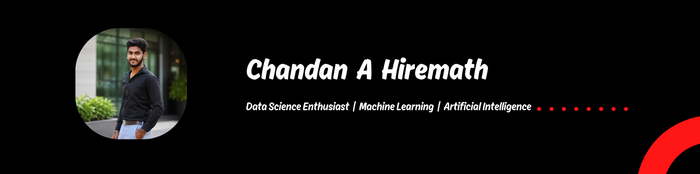

  

<h1 align="center">Hi 👋, I'm Chandan A Hiremath</h1>

<h3 align="center">
Data Science Enthusiast | Machine Learning | Artificial Intelligence
</h3>

Passionate about solving real-world problems using Machine Learning, Artificial Intelligence, and Data Science.

---

## 👨‍💻 About Me

- 🎓 Final Year B.Tech CSE Student
- 🌱 Currently learning Machine Learning, Deep Learning & Generative AI
- 💻 Building real-world AI projects
- 📚 Improving my Python and Data Science skills every day
- 🚀 Looking for Machine Learning and AI opportunities

---

## 🛠️ Tech Stack

- **Languages:** Python, SQL
- **Libraries:** NumPy, Pandas, Matplotlib, Seaborn, Scikit-learn
- **Tools:** Git, GitHub, VS Code
- **Databases:** Oracle SQL
  
---

## 📈 GitHub Stats

---

## 🏆 GitHub Streak

---

## 💻 Most Used Languages

---

## 🚀 Featured Projects

- 📘 Data Science Learning Journey
- 🤖 AI Legal Reference & Case Retrieval System

---

## 📜 Certifications

- ☁️ Google Cloud – Introduction to Generative AI (Skill Badge)
- 🤖 Infosys Springboard – AI Virtual Internship
- 📊 HP LIFE – Data Science & Analytics
- 📈 Tata Group (Forage) – Data Visualisation
- ⚡ Spark Internship Program
- 📊 Power BI Workshop

---
## 📫 Connect With Me

- 💼 LinkedIn: https://www.linkedin.com/in/chandan-a-hiremath-9b3a92316
- 📧 Email: chandanhiremath19@gmail.com
- 💻 GitHub: https://github.com/chandanhiremathmath
